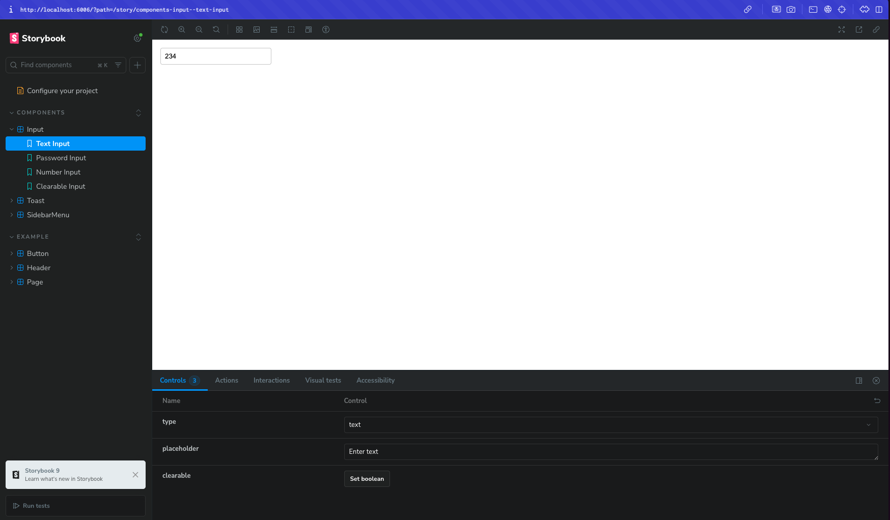
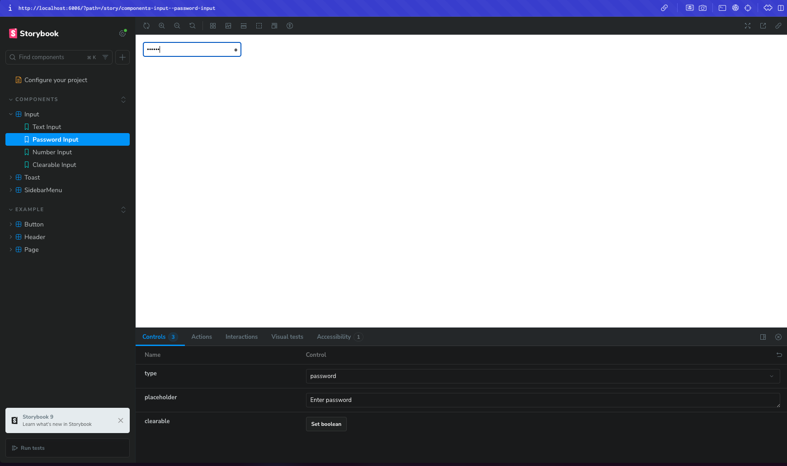
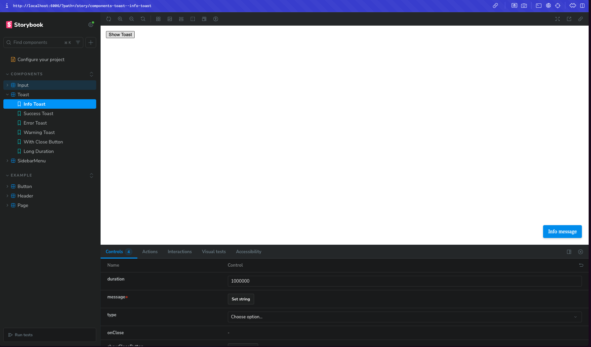
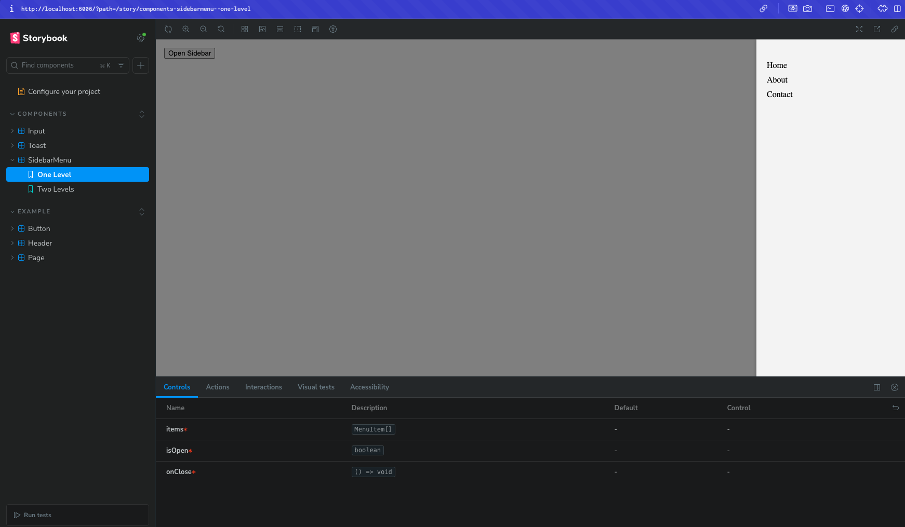
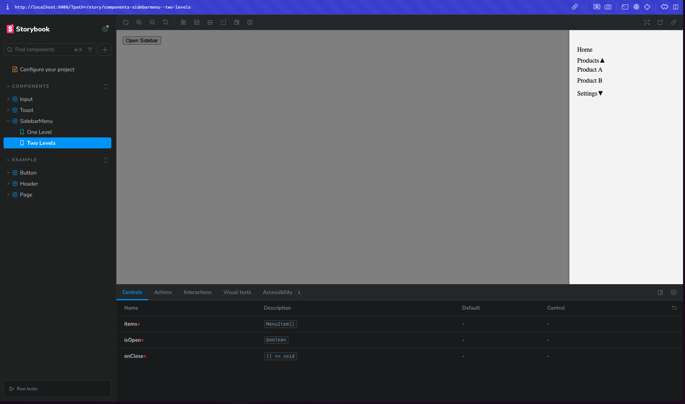

# React Component Library

A small React UI component library built with Storybook.

## Setup Instructions

- Clone the repo: `git clone <your-repo-url>`
- Install dependencies: `npm install`
- Run dev server: `npm run dev`
- Run Storybook: `npm run storybook`

## Folder Structure

src/
├── components/
│ ├── Input/
│ ├── Toast/
│ └── SidebarMenu/
├── stories/
└── index.ts

## Screenshots

### Input Component

### Toast Component

### SidebarMenu Component

